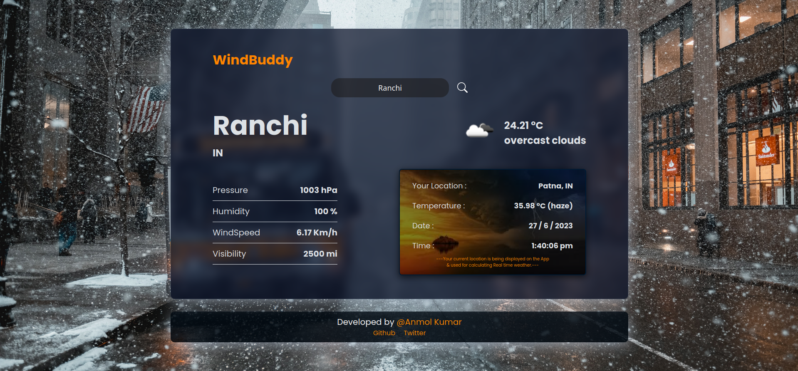

# Windbuddy

## A Weather App

A simple weather application built with ReactJS that provides current weather information for a given location.

## Features

- Display current weather conditions, including temperature, humidity, and weather description.
- Automatically detects and displays the user's location weather by default.
- Allow users to search for weather information in different locations.
- Use of an external API to fetch weather data.

## Technologies Used

   - ReactJS
   - HTML
   - CSS

## Demo

Screenshot of the app

## Setup

1. Clone the repository:
   git clone https://github.com/Anmol8611/windbuddy.git

2. Navigate to the project directory:
   cd weather-app

3. Install the dependencies:
   npm install

4. Start the development server:
   npm run dev

Open your browser and visit http://localhost:5173 to see the weather app.